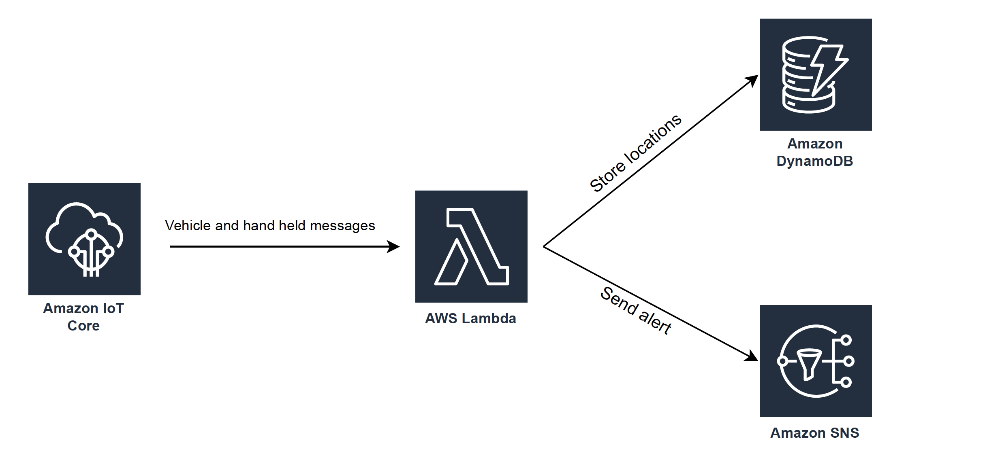
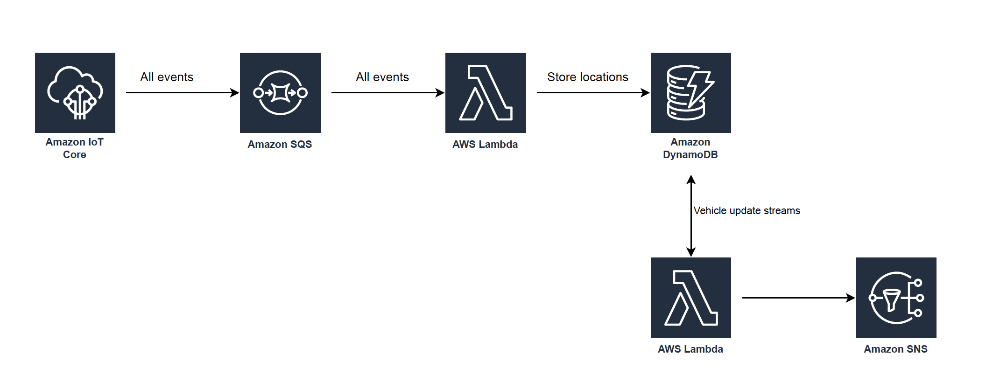
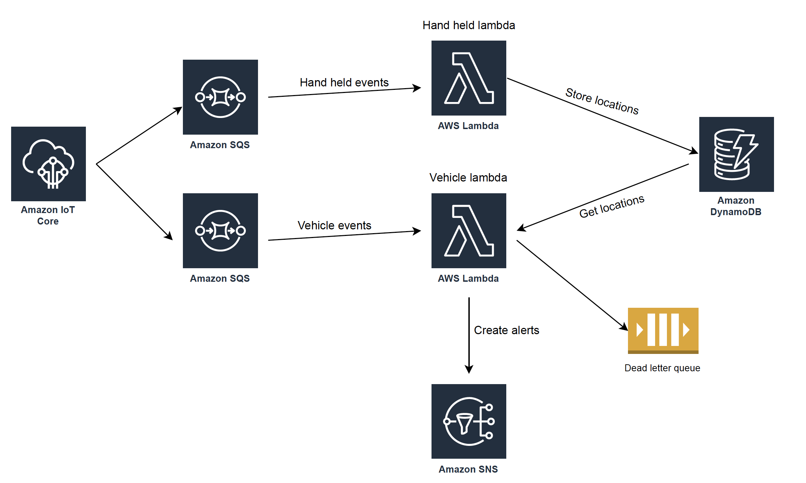

# Solutions

## 1- One lambda

### Explaination
- All events (vehicle and hand held devices location messages) from the AWS IoT core will directly trigger a lambda
- The lambda will be responsible for implementing all the logic to calculate the distance and creating an alert

### Pros and cons
- A very simple and straight-forward solution to implement
- The events will be processed in near real time
- The cost of the solution will be high since we will be paying for large number of lambda invocations
- Large number of lambda executions will create performance issues hence poor scalability
## 2- One queue and two lambdas

### Explaination
- All events (vehicle and hand held devices location messages) from the AWS IoT core will go to a persistent SQS
- An AWS lambda will consume messages from the SQS and store the latest location of each device (vehicle and hand held) in a table inside dynamodb
- Another lambda will listen to update stream events from the dynamodb
    - It is important to note that lambda will only listen to vehicle update events (using dynamodb change stream filtering) because if we listen to both events, lambda will end up processing duplicate messages since vehicle and hand held device are treated as a pair
- The lambda will get the update vehicle event and fetch the latest location of the paired hand held device, calculate the distance and create an alert

### Pros and cons
- The solution is more costly since it uses an SQS and Dynamodb streams
- The events will not be processed near real time since they will first be persisted in SQS
- The design can scale well since it uses queue and dynamodb streams

## 3- Two queues and two lambdas

### Explaination
- All vehicle events from AWS IoT core will go to vehicle SQS
- All hand held device events will go to the hand held SQS
- Hand held device lambda will consume events from hand held SQS and store the latest location of each hand held device in a dynamodb table
- Vehicle lambda will consume events from the vehicle SQS and implement the logic of calculating the distance b/w vehicle and the paired hand held device and create alert
### pros and cons
- This solution is highly efficient and scalable since it uses two separate queues for different events hence allowing both to scale indepdently  
- The design uses two separate lambdas with relatively independent logic hence better maintaibility and testability
- The solution is more complex compared to the first two designs
- The cost of the solution is more or less comparable to the second solution

## Implementation
Solution 2 and 3 looks reasonable when it comes to scalability, performance and cost. I am more in favour of using solution 3 even though it is slightly more complex but it provides better separation of concern with relatively two independent components that can be maintained, extended and tested relatively independent of each other.

Also, one of PostNL engineers probably has already implemented the solution-2 in one of the earlier submissions that I found on GitHub so I want to go with a different approach and discuss the tradeoffs 😁